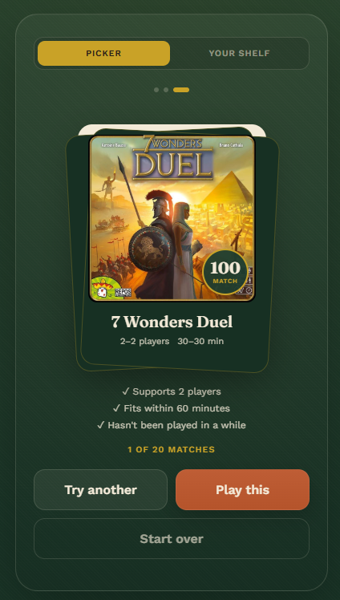
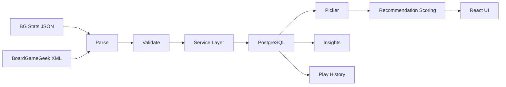

# Board Game Picker


Board Game Picker is a mobile-first application that helps answer a simple question: what should we play tonight?

It imports a board game collection and play history, stores the data in PostgreSQL, and recommends suitable games based on player count, available time, complexity and recent play history.

I built the project to develop practical data engineering skills around ingestion, transformation, relational modelling, APIs, testing and data-driven recommendation logic.

<p align="center">
  
</p>

The picker ranks suitable games using session criteria and play history, and explains why each game was recommended.

## Current features

- Import collections and historical plays from BG Stats JSON exports
- BoardGameGeek XML API integration for collection and metadata data
- PostgreSQL persistence with SQLAlchemy and Alembic migrations
- Idempotent imports using source identifiers
- Recommendation engine using filters, weighted scoring and play history
- Human-readable reasons for recommendations
- Record plays from the frontend
- Collection insights including total plays, most played, last played and never played games
- Mobile-first React/TypeScript PWA
- Automated backend tests

## Architecture



Collection and play data are normalised into PostgreSQL and reused by the picker, insights and recommendation logic.

### Database model

```mermaid
erDiagram
    erDiagram
    GAMES ||--o{ PLAYS : has

    GAMES {
        int id PK
        int bgg_id
        string name
        int year_published
        int min_players
        int max_players
        int min_play_time
        int max_play_time
        float complexity
        float rating
        boolean owned
        string image_url
        string thumbnail_url
    }

    PLAYS {
        int id PK
        int game_id FK
        int player_count
        datetime played_at
        int duration_minutes
        string source
        string source_play_id
    }
```

The backend separates API, service and repository layers so business logic is not tied directly to HTTP or database code. Historical plays use a unique source and source play ID combination so repeated imports do not create duplicates.

## Data flow

Collection imports are transformed into a common game model before being persisted. Existing games are updated rather than duplicated.

Historical BG Stats plays are resolved to games using BoardGameGeek IDs and deduplicated using their source and play UUID. This means the same export can be processed repeatedly without creating duplicate play records.

The same PostgreSQL data is then used for both collection analytics and recommendation scoring.

## Recommendation engine

Games are first filtered by criteria such as:

- player count
- maximum play time
- maximum complexity
- ownership status

Eligible games are ranked using deterministic weighted scoring. Play history is included so games that have been neglected can rank above otherwise similar choices.

The API returns the score and the reasons behind the recommendation rather than treating the result as a black box.

## Technology

**Backend:** Python 3.12, FastAPI, Pydantic, SQLAlchemy, psycopg, httpx, pytest

**Data:** PostgreSQL 16, Alembic

**Frontend:** React, TypeScript, Vite, vite-plugin-pwa

**Development:** Docker Compose, Git

## Project structure

```text
backend/
  api/             FastAPI endpoints
  bgg/             BoardGameGeek client and parsers
  bgstats/         BG Stats parsers
  database/        database configuration and models
  migrations/      Alembic migrations
  repositories/    persistence layer
  services/        application and recommendation logic
  tests/            backend test suite

frontend/           React/TypeScript PWA

docker-compose.yml  local PostgreSQL environment
```

## Running locally

### Requirements

- Python 3.12+
- Node.js
- Docker Desktop / Docker Compose

Start PostgreSQL from the repository root:

```bash
docker compose up -d
```

From `backend`, apply migrations and start the API:

```bash
alembic upgrade head
uvicorn api.main:app --reload
```

The backend expects `DATABASE_URL` to be set. Personal collection exports and local secrets are excluded from source control.

From `frontend`:

```bash
npm install
npm run dev
```

Run backend tests from `backend`:

```bash
python -m pytest
```

Check migration/model alignment with:

```bash
alembic check
```

## Next steps

- Add players and participant-level game sessions
- Record winners and scores
- Extend historical BG Stats ingestion to participant data
- Expand player and collection analytics
- Add richer collection metadata such as designers, publishers, categories and mechanics
- Add deployment automation and deploy the application to the cloud

## Why I built it

The project started as a useful way to choose a game from my own collection, but it also provides an end-to-end data engineering problem: ingest data from different sources, normalise it, load it safely, model it relationally, expose it through APIs and use it for analytics and recommendations.

The project is under active development.